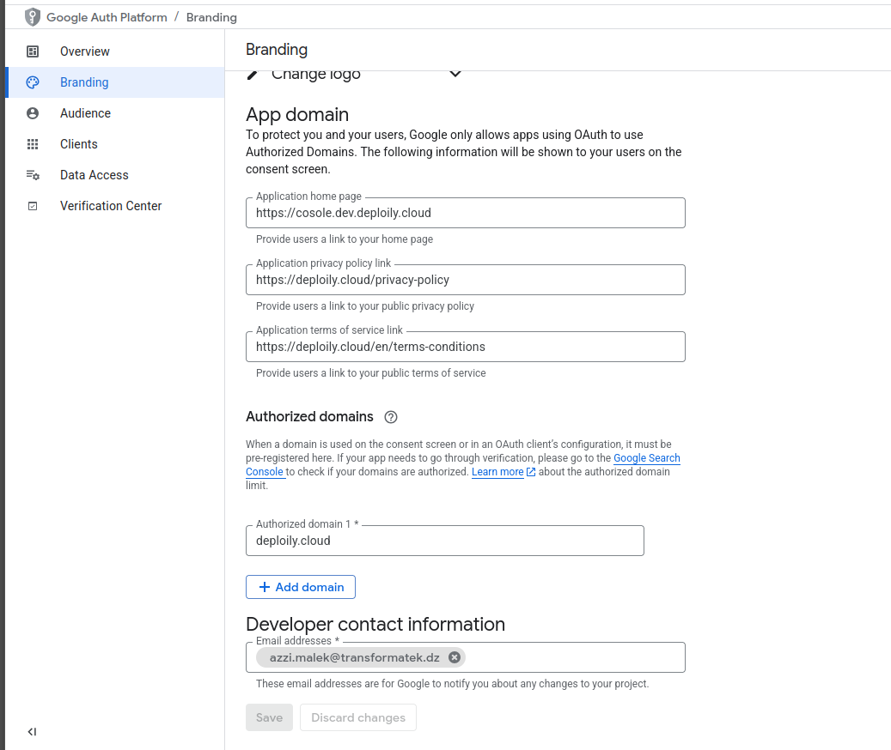

# Procedure: Enable Terms and Conditions in Keycloak

This guide explains how to require user consent to **Terms of Service** and **Privacy Policy** during registration in Keycloak.

## Steps

1. **Log in to the Keycloak Admin Console.**
2. In the left menu, click **Authentication**.
3. Go to the **Flows** tab.
4. Select the **Registration** flow.
5. Locate the **Terms and Conditions** row in the flow list.
6. Set the dropdown to **Required** for the **Terms and Conditions** step.

    This will enforce the user agreement at registration.

# Procedure: Add Custom Terms Text with Links in Keycloak Localization

This guide explains how to customize the **"Terms and Conditions"** text shown during user registration by adding a localized HTML phrase using **Realm Overrides** in Keycloak.

## Steps

1. Log in to the **Keycloak Admin Console**.

2. In the left menu, go to **Realm settings**.

3. Click on the **Localization** tab.

4. Enable **Internationalization** if it is not already enabled.

5. Click on the **Realm overrides**.

6. Click **Add translation**.

7. Fill out the form as follows:
   - **Key**: `termsText`
   - **Value**:

     ```html
     I agree to the <a href="https://example.com/terms">Terms of Service</a> and <a href="https://example.com/privacy">Privacy Policy</a>.
     ```

     > Replace `https://example.com/terms` and `https://example.com/privacy` with your actual URLs.

8. Click **Save**.

## Result

Users will see the following sentence during registration:

> I agree to the [Terms of Service](https://example.com/terms) and [Privacy Policy](https://example.com/privacy).

Where **Terms of Service** and **Privacy Policy** are clickable links.


# ✅ Procedure: Enable Sign in with GitHub in Keycloak

This guide explains how to configure **GitHub login** as an identity provider in Keycloak.

---

## 1. 🧱 Create a GitHub OAuth App

1. Go to [https://github.com/organizations/deploily/settings/applications](https://github.com/organizations/deploily/settings/applications)
2. Click **"New OAuth App"**
3. Fill in the fields:

   - **Application name**: `Deploily Login`
   - **Homepage URL**:  
     ```
     https://auth.dev.deploily.cloud
     ```
   - **Authorization callback URL**:  
     ```
     https://auth.dev.deploily.cloud/realms/myrealm/broker/github/endpoint
     ```

4. Click **Register application**
5. Copy the **Client ID** and **Client Secret**

---

## 2. 🔐 Configure GitHub as Identity Provider in Keycloak

1. Log into the **Keycloak Admin Console**
2. Select your realm (e.g., `myrealm`)
3. Go to **Identity Providers**
4. Click **"Add provider" → GitHub**
5. Fill in the required fields:
   - **Client ID**: (from GitHub)
   - **Client Secret**: (from GitHub)
   - **Default Scopes**: `user:email`
6. Click **Save**

---

# 🔗 How to Enable "Sign in with LinkedIn" in Keycloak

## ✅ Step 1: Create a LinkedIn Application

1. Go to the [LinkedIn Developer Portal](https://www.linkedin.com/developers/apps).
2. Click **"Create App"**.
3. Fill in the required information:
   - **App name**: `YourAppName` (e.g., Deploily Cloud)
   - **LinkedIn Page**: You **must** select a LinkedIn *Company Page*, not a personal profile.
     > If you don’t have one, [create it here](https://www.linkedin.com/company/setup/new/)
   - **Privacy policy URL**: `https://deploily.cloud/privacy-policy`
   - **App logo**: Upload a square image (minimum 100x100 pixels).
   - Accept the **Legal Agreement**.
    
4. After creating the app, go to your app's **Auth** section and copy:
   - `Client ID`
   - `Client Secret`

5. Under **OAuth 2.0 Settings**, set the **Authorized redirect URL**: `https://auth.dev.deploily.cloud/realms/myrealm/broker/ linkedin-openid-connect/endpoint`
  
6. Go to the **Products** tab in your app settings and click **"Request access"** next to:

> **Sign In with LinkedIn using OpenID Connect**
  
  
### 6. Add LinkedIn Identity Provider in Keycloak

- Go to **Identity Providers**
- Fill the form:
- **Alias**: `linkedin-openid-connect`
- **Client ID**: (paste from LinkedIn)
- **Client Secret**: (paste from LinkedIn)

- Save

---

### ✅ Done!

# ✅ Procedure: Enable Sign in with Google in Keycloak

This guide explains how to configure **Google login** as an identity provider in Keycloak.

---

## 1. 🧱 Create a Google OAuth App

1. Go to [https://console.developers.google.com/](https://console.developers.google.com/)
2. Create a new project or select an existing one.
   
3. In the left menu, go to **APIs & Services > Credentials**
4. Click **Create Credentials → OAuth client ID**
5. Select **Web application**
6. Fill in:
   - **Name**: `Keycloak Google Login`
   - **Authorized redirect URIs**:

     ```
     https://<your-keycloak-domain>/realms/myrealm/broker/google/endpoint
     ```

7. Click **Create**
8. Copy the **Client ID** and **Client Secret**

---

## 2. 🔐 Configure Google as Identity Provider in Keycloak

1. Log in to the **Keycloak Admin Console**
2. Select your realm (e.g., `myrealm`)
3. Go to **Identity Providers**
4. Click **"Add provider" → Google**
5. Fill in:
   - **Client ID**: (from Google Console)
   - **Client Secret**: (from Google Console)
   - **Default Scopes**: `openid email profile`
6. Click **Save**

---

## ✅ Result

Users will be able to sign in using their **Google account**.

---

# ✅ Procedure: Enable Sign in with GitLab in Keycloak

This guide explains how to configure **GitLab login** as an identity provider in Keycloak.

---

## 1. 🧱 Create a GitLab OAuth Application

1. Go to [https://gitlab.com/-/profile/applications](https://gitlab.com/-/profile/applications)
2. Fill in the fields:
   - **Name**: `Keycloak GitLab Login`
   - **Redirect URI**:

     ```
     https://<your-keycloak-domain>/realms/myrealm/broker/gitlab/endpoint
     ```

   - Check the following **Scopes**:
     - `read_user`

3. Click **Save application**
4. Copy the **Application ID** and **Secret**

---

## 2. 🔐 Configure GitLab as Identity Provider in Keycloak

1. Log in to the **Keycloak Admin Console**
2. Select your realm (e.g., `myrealm`)
3. Go to **Identity Providers**
4. Click **"Add provider" → OpenID Connect v1.0**
5. Fill in:
   - **Alias**: `gitlab`
   - **Display Name**: `Sign in with GitLab`
   - **Client ID**: (GitLab Application ID)
   - **Client Secret**: (GitLab Secret)
   - **Authorization URL**: `https://gitlab.com/oauth/authorize`
   - **Token URL**: `https://gitlab.com/oauth/token`
   - **User Info URL**: `https://gitlab.com/api/v4/user`
   - **Default Scopes**: `read_user`
   - **Client Authentication**: `client secret basic`
6. Click **Save**

---

## ✅ Result

Users will be able to sign in using their **GitLab account**.

# ✅ Procedure: Enable Sign in with Google in Keycloak

This guide explains how to configure **Google login** as an identity provider in Keycloak.

---

## 1. 🧱 Create a Google OAuth App

### 1.1 Go to Google Cloud Console

- URL: [https://console.developers.google.com/](https://console.developers.google.com/)

### 1.2 Create a New Project

- Click **"New Project"**
- Name your project


---

### 1.3 Fill in OAuth Consent Screen (Overview Section)

Go to **APIs & Services → OAuth consent screen**, and fill in:

- **App name**
- **User support email**


---

### 1.4 Configure App Audience (OAuth scopes)

- Select **External**


---

### 1.5 Add Contact Information

- Email addresses for support and developer notifications


---

### 1.6 Branding and Domains

- Add your **Keycloak domain** under **Authorized domains**  
  Example: `auth.dev.deploily.cloud`



---

### 1.7 Publish the App

- Click **Publish App**


---

### 1.8 Create clinet


# ✅ Procedure: Enable Sign in with GitLab in Keycloak

This guide explains how to configure **GitLab login** as an identity provider in Keycloak.

---

## 1. 🧱 Create a GitLab OAuth Application

### 1.1 Go to GitLab OAuth Applications Settings

- URL:  
  For GitLab.com → [https://gitlab.com/-/profile/applications](https://gitlab.com/-/profile/applications)  
  For self-managed GitLab:  
  `https://<your-gitlab-domain>/-/profile/applications`

---

### 1.2 Register a New Application

Fill in the form:

- **Name**: `Deploily Login`
- **Redirect URI**:


- **Scopes**:
- ✅ `read_user`
- ✅ `openid`
- ✅ `profile`
- ✅ `email`

- **Confidential**: ✅ Check the box


> Click **Save application**.

---

### 1.3 Copy Credentials

After saving:

- Copy the **Application ID** and **Secret**  
These will be used in Keycloak as **Client ID** and **Client Secret**.


---

## 2. 🔐 Configure GitLab as Identity Provider in Keycloak

1. Log into the **Keycloak Admin Console**
2. Select your realm (e.g., `myrealm`)
3. Go to **Identity Providers**
4. Click **"Add provider" → GitLab**

---

### 2.1 Fill Required Fields

- **Alias**: `gitlab`
- **Client ID**: *(GitLab Application ID)*
- **Client Secret**: *(GitLab Secret)*
- **Authorization URL**:  


